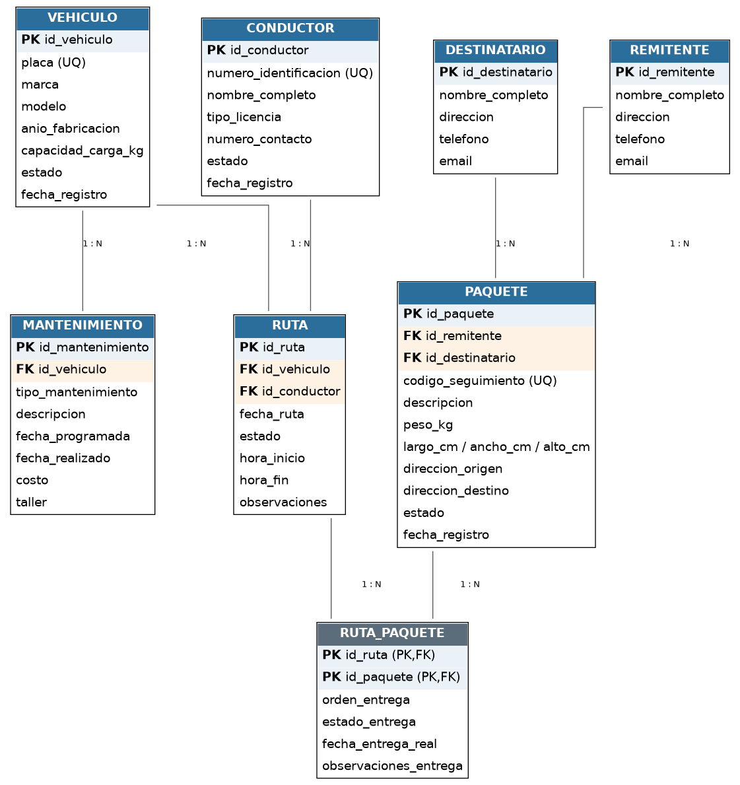

# RapidExpress — Sistema de Gestión de Flotas y Rutas

> Aplicación de consola (CLI) en Java para automatizar la gestión de la
> flota de vehículos, conductores, paquetes y rutas de la empresa de
> logística **RapidExpress**.

## Estado del proyecto

🚧 **Fase 1 completada:** análisis, arquitectura, base de datos y
estructura inicial del proyecto Maven. La lógica de negocio y la CLI
todavía no están implementadas. Ver [`docs/PROGRESS.md`](docs/PROGRESS.md)
para el detalle de avance y [`docs/HANDOFF.md`](docs/HANDOFF.md) para
continuar el desarrollo.

## Descripción del Proyecto

RapidExpress necesita reemplazar sus hojas de cálculo y comunicación
manual por un sistema centralizado que permita:

- Administrar el parque de **vehículos** y su historial de **mantenimientos**.
- Administrar los **conductores** y su disponibilidad.
- Registrar **paquetes** y llevar su ciclo de vida (bodega → tránsito → entrega).
- Planificar **hojas de ruta** diarias (vehículo + conductor + paquetes),
  respetando la capacidad de carga del vehículo.
- Generar **reportes** operativos y mantener una **auditoría** de las
  operaciones críticas del sistema en un archivo de texto centralizado.

El sistema se opera exclusivamente desde una interfaz de línea de
comandos (CLI), sin interfaz gráfica.

## Tecnologías Utilizadas

| Componente          | Tecnología                                   |
|---------------------|-----------------------------------------------|
| Lenguaje            | Java 17                                        |
| Gestor de build     | Maven                                          |
| Base de datos       | MySQL 8.x (alojada en la nube)                 |
| Conector JDBC       | `mysql-connector-j`                            |
| Pruebas             | JUnit 5                                        |
| Arquitectura        | MVC (Modelo – Vista – Controlador)             |
| Interfaz            | CLI (línea de comandos, sin GUI)               |
| Control de versiones| Git / GitHub (`main`, `develop`, `feature/*`)  |

## Diseño de la Base de Datos

La base de datos `rapidexpress_db` contiene 8 tablas: `vehiculo`,
`conductor`, `mantenimiento`, `remitente`, `destinatario`, `paquete`,
`ruta` y la tabla de asociación `ruta_paquete` (relación N:M entre
rutas y paquetes). El registro de auditoría **no** se modela en la base
de datos: se implementa como archivo de texto en la capa de aplicación,
tal como lo exige el enunciado.

Diagrama entidad-relación:



Explicación completa del modelo, decisiones y relaciones en
[`docs/DATABASE.md`](docs/DATABASE.md).

## Instalación y Ejecución

### 1. Requisitos previos

- JDK 17 o superior.
- Maven 3.9 o superior.
- Una instancia de MySQL 8.x en la nube (AWS RDS, Google Cloud SQL,
  Azure Database for MySQL, PlanetScale, etc.) con acceso desde tu
  máquina (host, puerto, usuario y contraseña).

### 2. Clonar el repositorio

```bash
git clone https://github.com/<usuario>/rapidexpress-management-system.git
cd rapidexpress-management-system
```

### 3. Configurar la base de datos en la nube

1. Crea la instancia MySQL en el proveedor de tu elección.
2. Conéctate a la instancia con un cliente MySQL (MySQL Workbench, DBeaver,
   `mysql` CLI, etc.) usando el host/puerto/usuario provistos por el proveedor.
3. Ejecuta el script de esquema:

   ```bash
   mysql -h <host> -P <puerto> -u <usuario> -p < database/1_schema_ddl.sql
   ```

4. Ejecuta el script de datos de ejemplo:

   ```bash
   mysql -h <host> -P <puerto> -u <usuario> -p < database/2_data_dml.sql
   ```

### 4. Configurar la conexión de la aplicación

Copia la plantilla de configuración y completa tus credenciales:

```bash
cp src/main/resources/application.properties.example src/main/resources/application.properties
```

Edita `application.properties` con el host, puerto, usuario, contraseña
y nombre de la base de datos de tu instancia en la nube. Este archivo
está excluido de Git (ver `.gitignore`) para no exponer credenciales.

### 5. Compilar el proyecto

```bash
mvn clean package
```

### 6. Ejecutar la aplicación

```bash
java -jar target/rapidexpress.jar
```

> **Nota:** el punto 6 asume que la Fase 2 (implementación de la lógica
> de negocio y la CLI) ya fue completada. En el estado actual del
> repositorio, el proyecto compila la estructura base pero aún no
> contiene la clase `Main` ni los módulos funcionales — ver
> [`docs/PROGRESS.md`](docs/PROGRESS.md).

## Guía de Uso

La aplicación se opera completamente desde la terminal mediante un
menú de texto interactivo (módulos de vehículos, conductores, paquetes,
rutas y reportes). La guía de uso funcional detallada se documentará
en esta sección a medida que se implemente cada módulo (Fase 2 en
adelante).

## Estructura del Repositorio

```
rapidexpress-management-system/
├── .gitignore
├── README.md
├── pom.xml
├── database/
│   ├── diagrama_entidad_relacion.png
│   ├── 1_schema_ddl.sql
│   └── 2_data_dml.sql
├── docs/
│   ├── PROJECT_CONTEXT.md
│   ├── ARCHITECTURE.md
│   ├── DATABASE.md
│   ├── DECISIONS.md
│   ├── PROGRESS.md
│   └── HANDOFF.md
└── src/
    └── main/
        ├── java/com/rapidexpress/
        │   ├── model/        # Entidades del dominio
        │   ├── dao/          # Acceso a datos (JDBC / MySQL)
        │   ├── service/      # Lógica de negocio
        │   ├── controller/   # Controladores (MVC)
        │   ├── view/         # Interfaz de consola (MVC)
        │   ├── audit/        # Registro de auditoría en archivo de texto
        │   ├── config/       # Configuración y conexión a la BD
        │   ├── exception/    # Excepciones propias del dominio
        │   └── util/         # Utilidades generales
        └── resources/
            └── application.properties.example
```

Detalle completo de la arquitectura en [`docs/ARCHITECTURE.md`](docs/ARCHITECTURE.md).

## Autores

- *(Completar con nombre del/los estudiante(s) responsables del proyecto)*

## Licencia

Proyecto académico — uso educativo.
